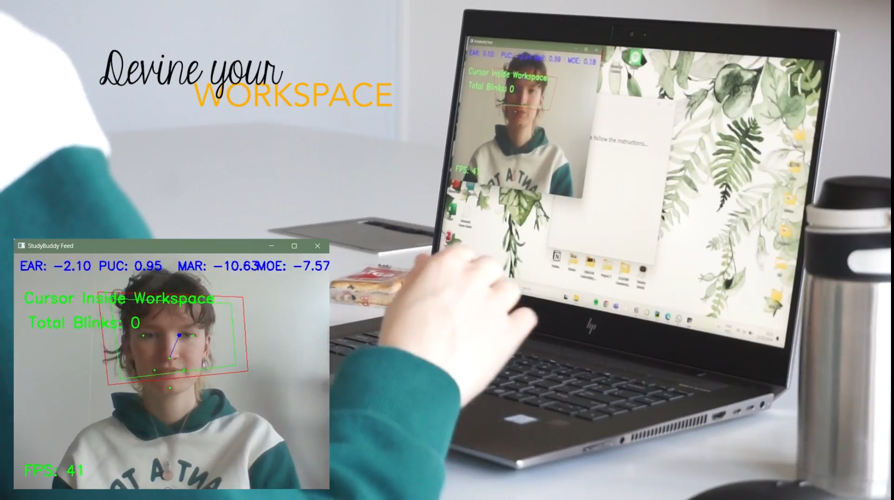

# Study Buddy - An XAI tool that aids students in self-regulated learning using the pomodoro method.

This repository provides a Python-based implementation for a Study Buddy application that can help monitor users studying behaviour, providing real-time feedback to the user.

<p align="center">
  
  
  
</p>

## Requirements

- **Python version**: 3.11
- **ChatGPT API Key**: Required for certain functionalities. Add your API key to `helpers.py`.

## Setup Instructions

1. **Clone this repository**:
   ```bash
   git clone https://github.com/JelmerzTue/StudyBuddy.git
   cd study-buddy
   ```

2. **Install dependencies**:
   ```bash
   pip install -r requirements.txt
   ```

3. **Set up your ChatGPT API key**:
   - Open `helpers.py` and add your ChatGPT API key to enable specific functionality.
   ```python
   CHATGPT_API_KEY = 'your_api_key_here'
   ```

## File Descriptions

- **models/**: Directory containing pre-trained models for FaceMesh detection and predicting User behaviour.
- **BlinkDetector.py**: Class for detecting blinks and eyes closed based on the facial landmarks.
- **FaceMeshProcessor.py**: Processes the face mesh to extract relevant features for analysis.
- **FeatureExtraction.py**: Handles the extraction of features used for prediction users behaviour.
- **Liveplotter.py**: Class for providing real-time plotting of various metrics to aid in monitoring, used for monitoring realtime features values.
- **ModelCreation.ipynb**: Jupyter Notebook used for building adn training the user state prediction model.
- **UI_study_buddy.py**: Main script for running the UI of the Study Buddy application.
- **data_complete.csv**: CSV file containing labeled data used for model training and evaluation.
- **helpers.py**: Utility functions, including API key management and other helper functions.
- **requirements.txt**: Lists all dependencies needed to run this project.
- **studybuddy_images/**: Directory containing image files representing different robot emotions, used in the UI.

## Running the Project

After installing the dependencies and setting up the API key, you can run the main application with the following command:

```bash
python UI_study_buddy.py
```

This will launch the Study Buddy Application.

## License

MIT License.
